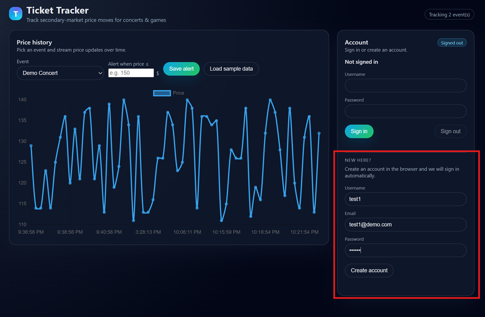
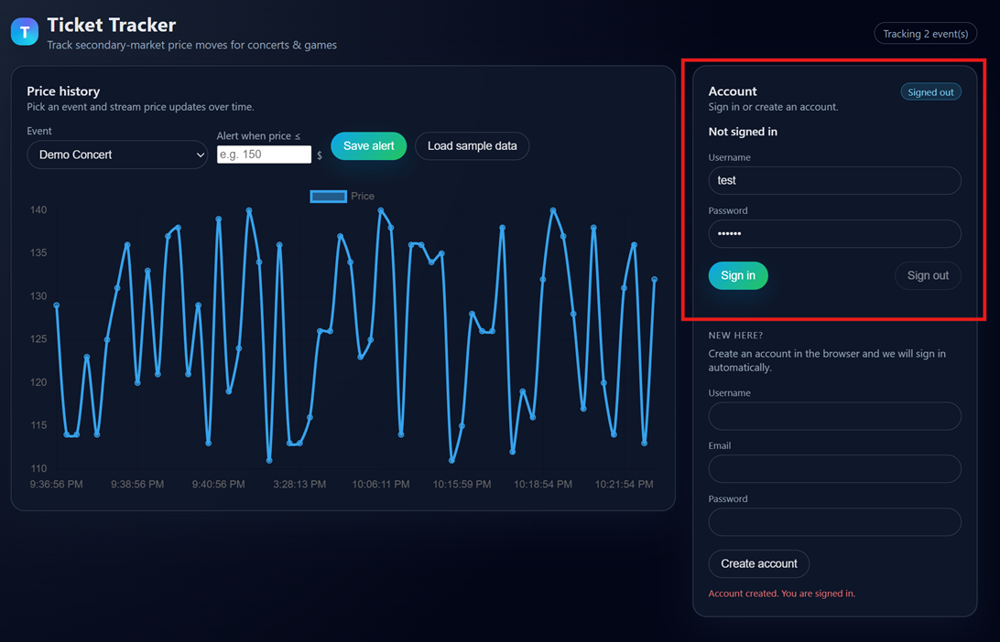
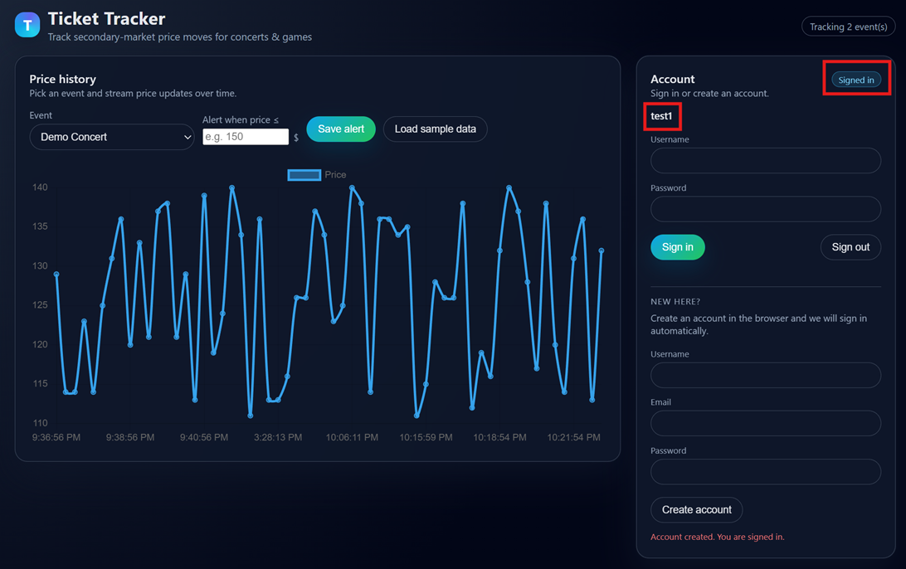
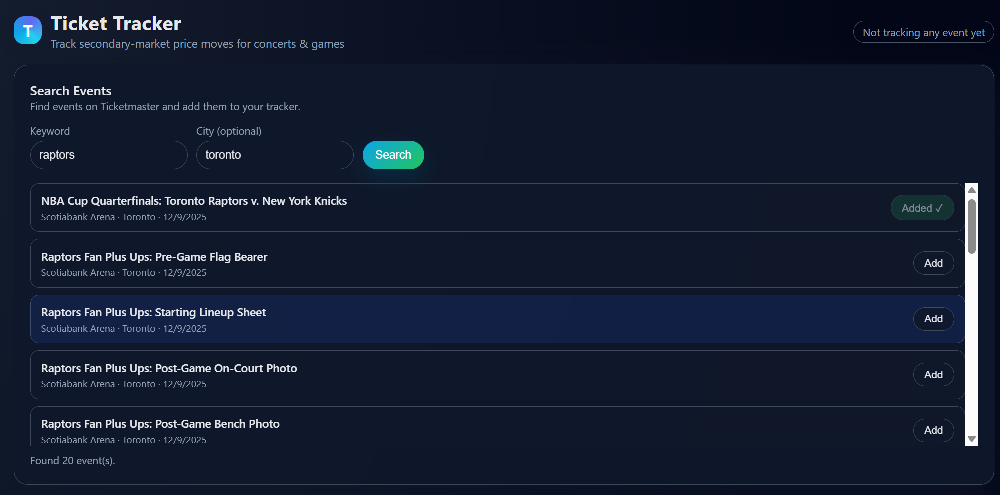
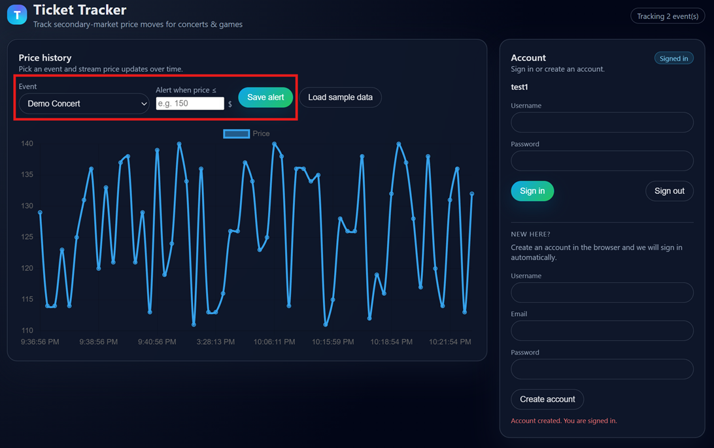

# ECE1779 Project Final Deliverable

Prepared by:
|Name|Student Number|Email|
|:--:|:---:|:--:|
|Wentao Xu|1002434895|wentao.xu@mail.utoronto.ca|
|Jiayi (Jeffery) Guo|1005907306|jeffery.guo@mail.utoronto.ca|

## 1.0 Motivation
Ticket prices for concerts and sports events are highly dynamic and often opaque. Fans frequently overpay because they lack visibility into historical prices and have no tools to decide whether a current price is “good” or “bad”. Existing platforms focus on discovery and checkout, but not on price history, trends, and alerts.

Our team was motivated by this pain point: we personally spend time watching ticket prices for NBA games and concerts and felt the lack of a simple tool that tracks specific events and visualizes price evolution over time. We also wanted a project that gives us hands-on experience with cloud-native design, containers, orchestration, and persistent storage in a realistic scenario.
This project aims to address both needs: it helps fans make more informed purchasing decisions, and it lets us apply ECE1779 concepts in a full end-to-end system.

## 2.0 Objectives
The main objectives of this project were:

### Build a cloud-native ticket price tracker

- Allow users to register events and store historical price observations in a relational database.  
- Visualize price history for each event over time via a simple web UI.

### Enable automated price alerts

- Allow users to register interest in specific events with a price threshold.  
- When a new price falls below the threshold, automatically trigger an email notification.

### Apply ECE1779 cloud computing practices

- Containerize services, use Docker Swarm for orchestration, and deploy to a DigitalOcean Droplet.  
- Use persistent block storage for PostgreSQL data.  
- Manage secrets securely (database and email credentials).  
- Provide backup and restore procedures for the database.

By the end of the project, we wanted a deployed, reproducible system that can be brought up from scratch using configuration files and scripts in this repository, not just local experiments.

## 3.0 Technical Stack
### Orchestration & Deployment

**Docker Swarm**

- Swarm is built into Docker, has a simpler learning curve, and matches our familiarity with Docker Compose.  
- We use Swarm stacks (`stack.yaml`, `stack.local.yaml`) to define services, networks, and secrets.

**DigitalOcean Droplet**

- Single-node Swarm cluster hosting both API and database services.  
- DigitalOcean Block Storage volume mounted at `/mnt/volume_tor1_01/postgres_data` for persistent PostgreSQL data.

### Backend

**Node.js 22 with Express 5**

- Single `api` service built from the `Dockerfile`.  
- REST API endpoints for authentication, events, prices, and user interests.

**PostgreSQL**

- Schema defined in `db/init.sql`:
  - `users` – registered users with hashed passwords.  
  - `events` – games or concerts.  
  - `prices` – historical price observations for each event.  
  - `user_event_interest` – per-user, per-event price thresholds for alerts.

**Security / Authentication**

- Login verifies hashes and returns user information without the password.  
- Enabled HTTPS with Nginx and a self-signed certificate to enable secure HTTP.  
- Stored sensitive data such as API keys, DB user/password, and email tokens with Docker secrets.

**Email Notifications**

- Gmail API (`googleapis` library) with an OAuth2 client.  
- Credentials (client id/secret, refresh token) provided via environment variables or Swarm secrets.  
- Notification logic: when a new price is inserted, the backend queries all interested users whose threshold is ≥ the new price and sends them an email alert.

**Cron-triggered function**

- DigitalOcean Function with a 15-minute cron trigger.  
- Calls the `/admin/fetch-prices` endpoint to update prices based on the official Ticketmaster Discovery API using `events.external_id`.

### Frontend

**Static HTML + Vanilla JavaScript**

- Served directly by the Express application via `app.use(express.static("web"))`.

**Chart.js**

- Used to render the price history time series in a responsive line chart.

**Local Storage**

- Basic tracking status (`"Tracking N event(s)"`) is kept in `localStorage` for a simple client-side “watch list”.

### DevOps / Tooling

**Docker + Docker Compose**

- `compose.yaml` for local two-container development (API + PostgreSQL).

**Docker Swarm secrets**

- Secrets for DB credentials and Gmail credentials defined at the Swarm level.

**Backup & Restore Scripts**

- `backup.sh` and `restore.sh` use `pg_dump` to achieve logical backups and restores.

**Monitoring**

- DigitalOcean’s built-in graph dashboards and alerts configured for CPU, memory, and disk usage for the Droplet.

## 4.0 Features
Our project implements a small but complete ticket price tracking application with a persistent PostgreSQL backend, a simple web UI, and optional email alerts. These features collectively satisfy the core course requirements and our project objectives of tracking, visualizing, and acting on ticket price changes.

The noticeable features of our project are:

### Event and price history management

Our application centers on managing events and their ticket price history. Each event (such as a concert or sports game) is stored in PostgreSQL with information like name, venue, city, and event time. For every event, the system records multiple price observations over time. Each price point is linked to its event and timestamp, so the backend can return a clean, ordered history that survives container restarts and redeployments. This provides the core stateful functionality required by the course: a persistent domain model backed by a relational database.

### Web UI for exploring events and charts

We provide a simple web UI for exploring events and charts. The frontend is served directly by the Node.js backend and loads the list of events when the page opens. If the database is empty, it automatically creates a demo event so the UI is always usable. When the user selects an event, the UI fetches its historical prices and renders an interactive line chart using Chart.js. This allows users to immediately see how ticket prices evolve over time instead of reading raw JSON responses.

### User account and per-user alerts

Our backend implements user accounts and per-user alert configuration. Users can register with a username, email, and password; the password is hashed with bcrypt before being stored in the database. After logging in, a user can associate a price threshold with a specific event. These user–event interests are stored in a separate table, so each user has their own view of what counts as a “good” price for each event.

### Client-side tracking of events

The web UI also supports client-side tracking of events. A “Track / Untrack” button lets users mark the currently selected event as tracked. The tracked IDs are stored in `localStorage`, and the UI displays how many events are being tracked. This implementation is intentionally lightweight: it does not create extra tables in the database, but it still gives users a basic watch list and makes it easier to focus on a subset of events.

### Event search bar and dynamic event import

To make it easy to bring real-world events into the tracker, the application includes a **Search Events** panel at the top of the page. Users can enter a keyword (for example, “Raptors”) and an optional city (for example, “Toronto”), then click **Search**. The backend queries Ticketmaster for matching events and displays the results as a list directly under the search bar.

Each search result shows the event title, venue, city, and date, with an **Add** button on the right. Clicking **Add** inserts that event into our `events` table (if it is not already present) and adds it to the **Event** dropdown in the “Price history” section below. Users can click **Add** on multiple results, building up a small watch list of events in the dropdown.

Once events have been added, the user can pick any of them from the dropdown, view its price history on the chart, and set a price alert by entering a threshold and clicking **Save alert**. In this way, the search bar ties together external data (Ticketmaster), our persistent storage, and the alerting mechanism, while keeping the workflow simple and interactive.

### Email notifications

Our system integrates email notifications based on these thresholds. Whenever a new price is recorded for an event, the backend checks all user interests for that event. If the new price is less than or equal to a user’s threshold, the system sends an email using the Gmail API, with credentials managed via Docker Swarm secrets or environment variables. This closes the loop: users do not need to refresh the page or poll the API manually, because the application can actively notify them when ticket prices drop to their target level.

### Database backup and recovery

To support backup and recovery of our PostgreSQL data, the repository includes two shell scripts: `backup.sh` and `restore.sh`. The backup script runs `pg_dump` inside the database container and writes a timestamped `.sql` file into the `backups/` directory, while the restore script drops and recreates the public schema and replays one of these `.sql` files into the running database. This gives us a simple but reliable way to snapshot and restore the application state in both local development and the Swarm deployment.

### How these features fulfill course requirements and objectives

**Core technical requirements**

- **Containerization & local development**: `Dockerfile` + `compose.yaml` (Node.js backend + PostgreSQL).  
- **State management & persistence**: PostgreSQL with schema in `db/init.sql` and persistent storage via Docker volume (local) and DigitalOcean Volume (Swarm).  
- **Deployment provider**: Deployed on DigitalOcean using a Droplet.  
- **Orchestration**: Docker Swarm with replicated `ticket-tracker-app` service, overlay network, and secrets for credentials.  
- **Monitoring**: `/health` endpoint plus DigitalOcean metrics and alerts on CPU, memory, and disk.

**Advanced features (at least two, we implemented three)**

- **Security enhancements**: Password hashing with bcrypt and Swarm secrets for DB and Gmail credentials.  
- **Backup and recovery**: `backup.sh` and `restore.sh` for repeatable database backups and restores.  
- **External service integration**: Gmail API–based email notifications when ticket prices drop below user-defined thresholds.

**Project objectives**

- **Track and visualize ticket prices over time**: Events + prices tables, REST APIs, and Chart.js UI directly implement this.  
- **Help users avoid overpaying**: User-specific thresholds and email alerts notify users when prices reach their target level.  
- **Apply cloud-native concepts end to end**: Containerized services, Swarm orchestration, persistent volumes, provider monitoring, and backup/restore all come together in a reproducible deployment.

## 5.0 User Guide
Here are some guides to our main features:

### Sign up for an account

First-time users can register using the sign-up form in the bottom-right corner of the page. Enter your details and click **“Create account”**. If registration is successful, you will be logged in automatically. If something goes wrong, an error message will appear and you can adjust your input and try again.

### User login

Returning users can log in using the login form.

After a successful login, your username and login status are shown in the top-right corner of the page so you can confirm that you are signed in.

### Using the event search bar

To add real events to your tracker, use the **Search Events** panel at the top of the page:

1. At the top of the page, go to the **Search Events** section.
2. In the **Keyword** field, type part of the artist, team, or event name (e.g., `raptors`).
3. Optionally enter a **City** (e.g., `toronto`) to narrow the results.
4. Click **Search**. A list of matching events will appear below the search bar.
5. For each event you want to track, click **Add** on the right. Added events are inserted into the system and will appear in the **Event** dropdown in the “Price history” panel.
6. Scroll down to the **Price history** section, open the **Event** dropdown, and select one of the events you added.
7. You can now:
   - Click **Load sample data** to see prices for that event, or  
   - Enter a value in **“Alert when price ≤”** and click **Save alert** to set up an email notification for that event.


### Setting a threshold price

To set a price alert, first select the event you are interested in from the dropdown list. Then enter your desired threshold price and click **“Save alert”**. When the ticket price for that event falls to or below your threshold, the system will send you an email notification.



## 6.0 Development Guide
**Credentials sent to TA**
This section provides detailed instructions for setting up the development environment, database, and local testing using Docker Swarm

Please note that since the cron-triggered function uses Digital Ocean Function, the functinoality is not available to test locally. 
### 6.1 Prerequisites:
- Docker
- OpenSSL (for self-signing certificates)
- curl
- jq (optional for pretty-printing JSON resposne)

### 6.2 Project Structure
The project requires a parent directory containint the main project directory along with `nginx/` and `ssl/` directories for local testing:
```
Project/                          # Parent directory
├── ECE1779-Project/              # Main project repository
├── nginx/                        # Nginx configuration
│   └── nginx.conf                # Nginx reverse proxy config
├── ssl/                          # SSL certificates
│   ├── cert.pem                  # SSL certificate
│   └── key.pem                   # SSL private key
└── postgres_data/                # PostgreSQL data (created automatically)
```

### 6.3: Steps to Run App Locally
#### Step 1: Set Up Directory Structure
```bash
mkdir -p <path_to_project>/Project_Ticket_Tracker
cd <path_to_project>/Project_Ticket_Tracker

# clone repository
git clone https://github.com/JiayiGuo2001/ECE1779-Project.git

# create nginx and ssl directories
mkdir -p nginx ssl postgres_data
```

#### Step 2: Generate Self-Signed SSL certificate
```bash
cd ./ssl

# Generate self-signed cert 
openssl req -x509 -nodes -days 365 -newkey rsa:2048 \
  -keyout key.pem \
  -out cert.pem \
  -subj "/C=CA/ST=Ontario/L=Toronto/O=ECE1779/OU-Project/CN=localhost"
```

#### Step 3: Create Nginx configuration
Create the file `<path_to_project>/Project_Ticket_Tracker/nginx/nginx.conf`:

```bash
cd <path_to_project>/Project_Ticket_Tracker
cat > ./nginx/nginx.conf << 'EOF'
events {
    worker_connections 1024;
}

http {
    server {
        listen 80;
        return 301 https://$host$request_uri;
    }

    server {
        listen 443 ssl;
        
        ssl_certificate /etc/ssl/server.crt;
        ssl_certificate_key /etc/ssl/server.key;
        ssl_protocols TLSv1.2 TLSv1.3;

        location / {
            proxy_pass http://ticket-tracker-app:3000;
            proxy_set_header Host $host;
            proxy_set_header X-Real-IP $remote_addr;
            proxy_set_header X-Forwarded-Proto https;
        }
    }
}

EOF
```

#### Step 4: Update stack.local.yaml Paths if needed
If the project structure is correct (`ssl/`, `nginx/` and `postgres_data` directories are in the parent directory of the main project), no need to chagne stack.local.yaml. If stored elsewhere, edit stack.local.yaml to match nginx, ssl and postgres_data directories.

#### Step 5: Initialize docker Swarm
```bash
docker swarm init
```

#### Step 6: Create the External Network
docker network create --driver overlay app_network

#### Step 7: Create Docker Secrets (Credentials sent to TA)
**Note: The docker secrets have been provided to TA via Email. These are just place holders.**
```bash
# DB credentials:
echo "postgres_db_username" | docker secret create db_user - 
echo "postgres_db_password" | docker secret create db_password - 

# Gmail OAuth2 credentials (for email notification alerts)
echo "gmail_client_id" | docker secret create gmail_client_id - 
echo "gmail_client_secret" | docker secret create gmail_client_secret - 
echo "gmail_refresh_token" | docker secret create gmail_refresh_token - 

# Ticketmaster API key (Required for event search)
echo "ticketmaster_api_key" | docker secret create ticketmaster_api_key - 
```
Feel free to use your own gmail OAuth2 credentials or ticketmaster api key if you have them. 

#### Step 8: Build API Docker Image and Deploy the Stack
```bash
cd <path_to_project>/Project_Ticket_Tracker/ECE1779-Project
docker build -t ticket-tracker-api:latest. --no-cache
docker stack deploy -c stack.local.yaml ticket-tracker
```

#### Step 9: Verify Deployment
```bash
# Check running services
docker stack services ticket-tracker

# View logs from each service
docker service logs ticket-tracker_ticket-tracker-app
docker service logs ticket-tracker_postgres
docker service logs ticket-trakcer_nginx
```

#### Step 10: Accessing the service
After all three services are running, the UI can be accessed from https://localhost. Note that the browser would display a warning since this is a self-signed certificate. 

At this point the server is also accessible using curl.
## 7.0 Deployment Information
During grading, the deployed application is available at:

- Application link: https://167.99.187.11/

## 8.0 Video Demo

Our video demo walks through the main features of the Ticket Tracker application and shows it running in our DigitalOcean deployment.

- YouTube link: https://youtu.be/HnYqjL6n3CU

## 9.0 Individual Contributions
### Jiayi Guo

- Designed and implemented the **database layer**, including the PostgreSQL schema in `db/init.sql` (tables for users, events, prices, and user–event interests), primary/foreign keys, and constraints for data integrity.
- Implemented the main **backend features**, such as:
  - REST endpoints for events and price history,
  - user registration and login with bcrypt password hashing,
  - saving per-user alert thresholds,
  - the `/health` endpoint for basic status checks.
- Integrated the **email notification pipeline** using the Gmail API, including OAuth2 setup, sending logic, and wiring it into the price insertion flow so that alerts are triggered when prices fall below user thresholds.
- Helped configure the backend for containerized deployment (environment variables, database connection handling, and error logging).
- Added scheduled pulling to fetch prices from the Ticketmaster Discovery v2 API, using existing `events` table contents that have an `external_id` attribute, via a DigitalOcean Function with a cron trigger calling `/admin/fetch-prices` every 15 minutes.
- Built the **event search workflow** behind the “Search Events” bar, including the backend integration with the Ticketmaster Discovery API, the search endpoint that returns matching events by keyword and optional city, and the logic that inserts selected results into the `events` table so they appear in the price-history dropdown.

### Wentao Xu

- Designed and implemented the **frontend UI** for user login/registration and event tracking, including:
  - the layout and styling of the main page,
  - the login/sign-up forms and login status display,
  - the “Track / Untrack” button and client-side tracking logic with `localStorage`.
- Connected the web UI to the backend API, including loading events, displaying price history with Chart.js, and providing user-facing interactions such as the “Load sample data” and “Save alert” workflows.
- Implemented and tested the **backup and restore scripts** (`backup.sh` and `restore.sh`), and verified that they work correctly with the Docker Compose / Swarm setup to create and restore logical database snapshots.
- Contributed to project documentation and presentation materials, including the final report structure and explanations of the user-facing features.

## 10.0 Lessons Learned and Concluding
One of the main lessons we learned in this project is the value of starting with a simple, working core and then layering features on top of it. Getting the basic “events + prices + chart” loop running with Docker Compose and PostgreSQL made it much easier to reason about later changes. Once that path was stable, adding user accounts, per-user alerts, and Gmail integration felt more manageable, even when we ran into small bugs and configuration issues.

We also gained a much better understanding of what “stateful cloud-native” really means in practice. It is not just about putting a database in a container, but about making sure the data actually survives restarts and redeployments. Moving from local volumes to a DigitalOcean Volume, and then verifying that our backup and restore scripts worked as expected, showed us how important persistence and recovery are for real applications.

On the operational side, working with Docker Swarm, environment variables, and secrets taught us how deployment concerns can easily affect application behavior. We had to be careful about how we passed database credentials and Gmail credentials into the containers, and how we handled different settings for local development versus the deployed environment. DigitalOcean’s metrics and basic alerts also reminded us that monitoring does not have to be very complicated to be useful: even simple CPU, memory, and disk graphs help when debugging issues.

Finally, this project gave us hands-on experience in connecting a frontend, backend, and external service into one coherent system. We had to think about user experience (e.g., showing login status, making sure there is always at least one demo event), data modeling, and asynchronous email notifications at the same time. Overall, we are satisfied that our ticket tracker meets the core course requirements while remaining focused and understandable. If we had more time, the next steps would be to improve the UI, refine the alert management flow, and possibly add more real-time or automated data ingestion for ticket prices.